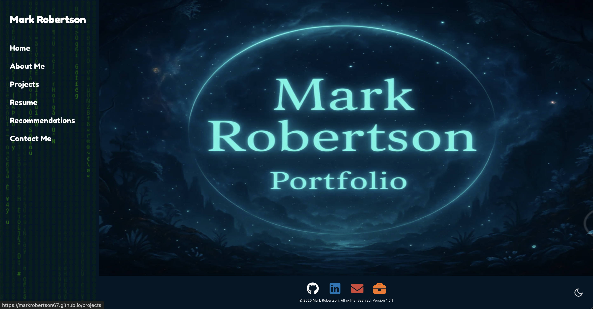
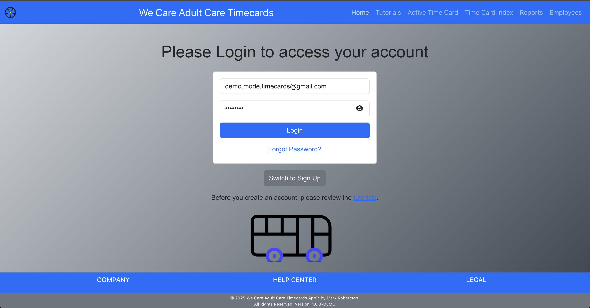
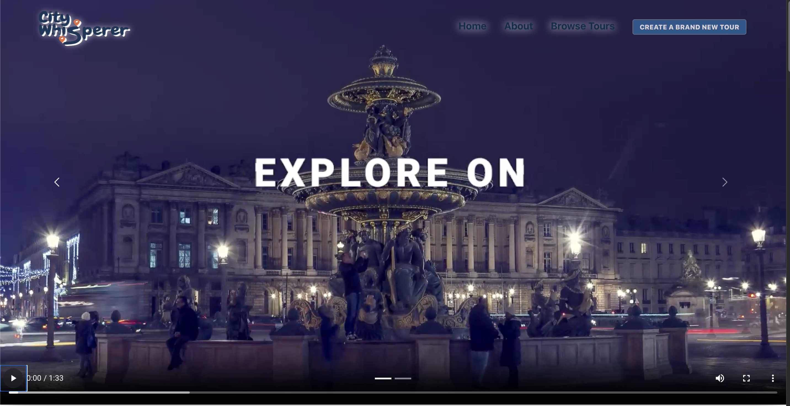

## 👋 Hi, I'm Mark Robertson 🇺🇸🇬🇧

### 🌐 My Sites

<table>
  <tr>
    <td align="center">
      <a href="https://markrobertson67.github.io/" target="_blank">
         
        <strong>Portfolio</strong> 
        markrobertson67.github.io
      </a>
    </td>
    <td align="center">
      <a href="https://wcac-timecards-demo.netlify.app/" target="_blank">
         
        <strong>Timecards Demo</strong> 
        wcac-timecards-demo.netlify.app
      </a>
    </td>
    <td align="center">
      <a href="https://citywhisperer-mark.netlify.app/" target="_blank">
         
        <strong>City Whisperer</strong> 
        citywhisperer-mark.netlify.app
      </a>
    </td>
  </tr>
</table>

👋 Former trader now focused on data analytics, and quantitative finance.

💻 I build dashboards, clean and analyze datasets, and develop insights that help solve business problems.

🎓 Proud Pursuit FSW grad, now deep-diving into machine learning, statistics, and algorithmic trading strategies.

🤝 Always open to collaborating on ML-driven trading tools, data science projects, and anything at the intersection of code and markets.

📚 Next up: pursuing certificates in Machine Learning, Artificial Intelligence, and Quantitative Finance.

🏎️ Off the clock, I’m a Formula 1 fanatic, world traveler, foodie, and movie buff.

---
### 📫 How to reach me:

- 
- 

---
### Profiles:

- Codewars: 
- Leetcode: 

---
## 🎓 Education & Awards

- **BS in Marketing**, Rutgers, The State University of New Jersey – School of Business  
- **BA in Applied Art**, University of Hertfordshire, UK  
- **Advanced Software Engineering Immersive Program**, Pursuit.org  
- **Award:** Best Storytelling, Pursuit Hackathon (Class of 9.3 & 9.4) — *accessandlearn.netlify.app*

---
## 💼 Professional Experience

- **Software Developer & Part-Time Driver**, We Care Adult Care, Inc.  
  *June 2023 – Feb 2025*  
  - Autonomously developed and deployed a full-stack timecard application, replacing a manual pen-and-paper system.  
  - Built the front end with JavaScript and React, and the back end with Express and SQL (Neon for database management).  
  - Launched the app via Netlify and Render; now actively used by staff.

- **Founder & Principal**, St. Albans Capital, LLC  
  *Mar 1996 – Dec 2022*  
  - Directed a team of five traders, managing daily transactions of \$100 M+ in high-yield bonds, equities, and U.S. Treasuries.  
  - Utilized Bloomberg Terminal to analyze market inefficiencies, price discrepancies, and liquidity trends, optimizing trading decisions.  
  - Delivered transparent market reports to high-net-worth clients, ensuring trust through strategic insights and clear communication.

- **CEO**, Phaz Music Corp. (Best of CES 2015 by Techlicious)  
  *Jun 2017 – Aug 2018*  
  - Raised \$5 M in seed financing with a CPA-authored offering memorandum.  
  - Oversaw product development, finalizing manufacturing in Shenzhen and lithium-battery configuration in Hong Kong.  
  - Negotiated distribution and sales-team agreements, forging critical partnerships to bring P2 headphones to market.

- **Managing Member**, Investment Club 101, LLC (“Black Box Trading”)  
  *Feb 2006 – Jul 2012*  
  - Co-founded a team to build and fund a black-box equity-trading system with a core AI engine.  
  - Secured \$100 K in seed capital for live beta trading, hosted on Genesis Securities.  
  - Launched and managed the beta system, driving early proof-of-concept success.

---
### 🛠 Languages and Tools :

  <!-- 1. Core languages -->
    </a>
  
  
  <a href="https://developer.mozilla.org/docs/Web/CSS" target="_blank" rel="noopener noreferrer">
    

  <!-- 2. Front-end frameworks & styling -->
  
  
  
  

  <!-- 3. Back-end runtime & framework -->
  
  

  <!-- 4. Database -->
  

  <!-- 5. Version control & package managers -->
  
  
  

  <!-- 6. Community & editors -->
  
  
  
  

 Icons by <a target="_blank" href="https://icons8.com">Icons8</a>
and devicon

---

