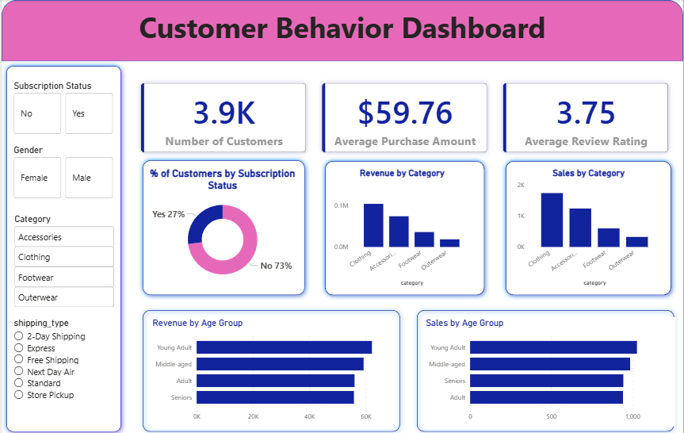
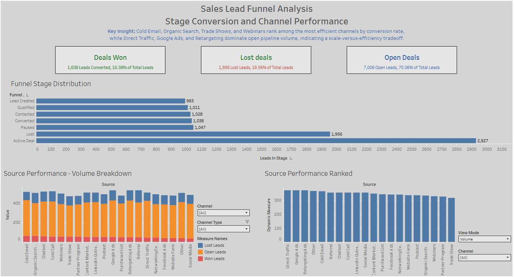
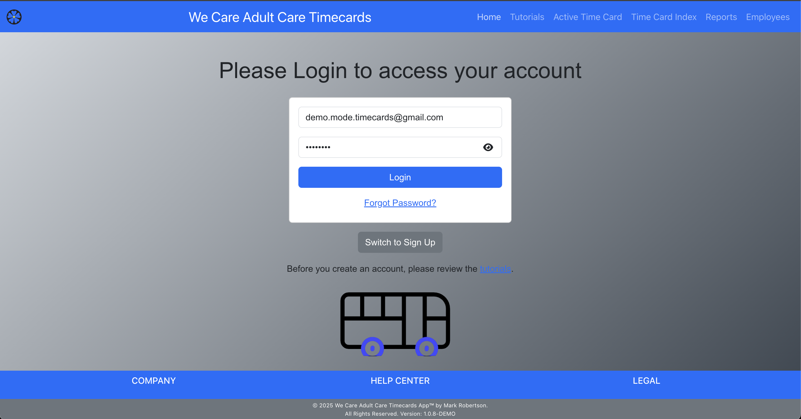
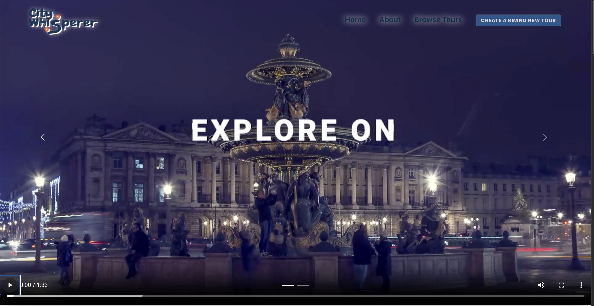
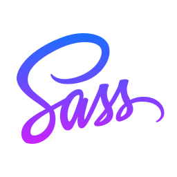
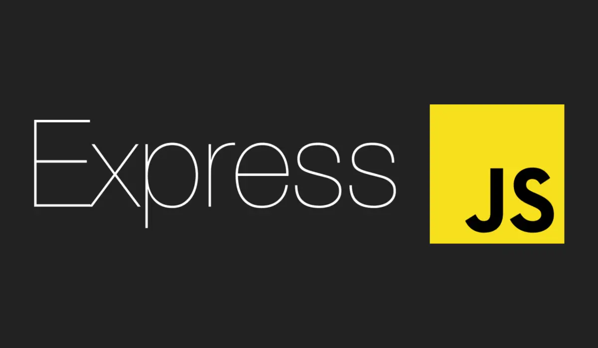
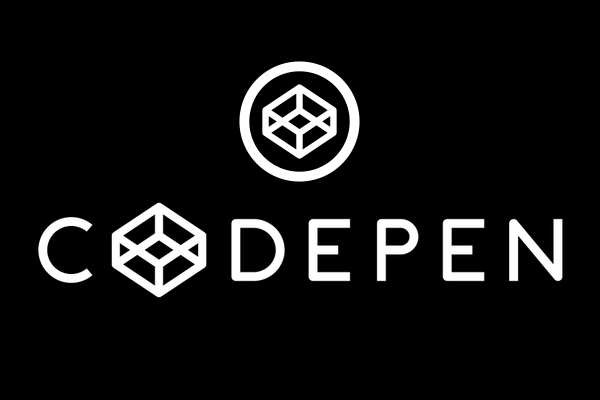

<h2>
👋 Hi, I'm Mark Robertson 🇺🇸🇬🇧

</h2>

📊 **Data Analyst with a finance background**, focused on turning raw data into clear, actionable insights.

🛠️ I work primarily with **SQL, Python, Excel, and Tableau** to clean, validate, and analyze datasets, and to communicate results through dashboards and reports that support business decision-making.

📈 Former **institutional trader**, bringing a quantitative, results-driven approach to data analysis, financial metrics, and stakeholder communication.

🎯 Currently seeking **Data Analyst or Business Analyst roles**, and open to collaborating on analytics, business intelligence, and finance-focused data projects.

---

🛠 Data & Analytics Tools

• SQL (PostgreSQL, MySQL)  
• Python (pandas, numpy, matplotlib, seaborn)  
• Tableau, PowerBi (Dashboards & Reporting)  
• Excel (PivotTables, VLOOKUP)  
• Data Cleaning & Validation

🛠 Development Tools

• Jupyter Notebook, Docker  
• Git, GitHub, VSCode  
• React, Node.js, Express

---

### 🌐 My Sites

#### 📁 Portfolio

<table style="width:100%;">
<tr>
<td align="center">

 

<strong>Portfolio</strong>
 

Central hub for data analytics projects, dashboards, and full-stack web apps, with resume, contact information, and references available.

 

<a href="https://markrobertson67.github.io/" target="_blank" rel="noopener noreferrer">
Live Site
</a>
&nbsp;|&nbsp;
<a href="https://github.com/MarkRobertson67/MarkRobertson67" target="_blank" rel="noopener noreferrer">
GitHub Repo
</a>

</td>
</tr>
</table>

---

#### 📊 Data Analytics Projects

<table style="width:100%;table-layout:fixed;">
<tr>

<!-- Sales Lead Funnel Analysis -->
<td align="center" valign="top" style="padding:12px;">

 

<strong>Sales Lead Funnel Analysis</strong>
 

Analyzed a sales leads dataset to measure funnel conversion rates and identify drop-off points using SQL, validated results in Excel, and built an interactive Tableau dashboard to surface actionable sales insights.

 

<em style="font-size:0.9em;">
SQL | Tableau | Excel | Data Cleaning | Funnel Analytics
</em>

  

<a href="https://public.tableau.com/views/SalesLeadFunnelStageDistribution/Dashboard1?:showVizHome=no&:toolbar=no&:tabs=no" target="_blank" rel="noopener noreferrer">
Live Dashboard
</a>
&nbsp;|&nbsp;
<a href="https://github.com/MarkRobertson67/sales_lead_funnel_analysis" target="_blank" rel="noopener noreferrer">
GitHub Repo
</a>

</td>

<!-- Customer Purchase Behavior Analysis -->
<td align="center" valign="top" style="padding:12px;">

 

<strong>Customer Purchase Behavior Analysis</strong>
 

Cleaned a retail customer dataset using Python (Pandas), analyzed purchasing behavior with SQL, and built a Power BI dashboard exploring revenue patterns, discount usage, and customer segmentation insights.

 

<em style="font-size:0.9em;">
Python | Pandas | SQL | Power BI | Customer Analytics
</em>

  

<a href="https://github.com/MarkRobertson67/Customer_Behavior_Analysis/blob/main/dashboard/customer_behavior_dashboard.pbix" target="_blank" rel="noopener noreferrer">
Download Dashboard (.pbix)
</a>
&nbsp;|&nbsp;
<a href="https://github.com/MarkRobertson67/Customer_Behavior_Analysis" target="_blank" rel="noopener noreferrer">
GitHub Repo
</a>

</td>

</tr>
</table>

---

#### 🖥️ Web Apps

<table style="width:100%;table-layout:fixed;">
<tr>

<!-- Timecards Demo -->
<td align="center" valign="top" style="padding:12px;">

 

<strong>Timecards Demo — Production Web App</strong>
 

Modeled and aggregated payroll time-series data to generate biweekly KPIs and export clean CSV reports for downstream payroll systems.

 

<em style="font-size:0.9em;">
SQL | PostgreSQL (Neon) | Data Modeling | Aggregations | Reporting
</em>

  

<a href="https://wcac-timecards-demo.netlify.app/" target="_blank" rel="noopener noreferrer">
Live App
</a>
&nbsp;|&nbsp;
<a href="https://github.com/MarkRobertson67/wcac_timecards_demo_frontend" target="_blank" rel="noopener noreferrer">
GitHub Repo
</a>

</td>

<!-- City Whisperer -->
<td align="center" valign="top" style="padding:12px;">

 

<strong>City Whisperer</strong>
 

Ingested and transformed multi-source API data to generate personalized walking tours using AI-generated content and geospatial logic.

 

<em style="font-size:0.9em;">
SQL | PostgreSQL | OpenAI API | Google Maps API | Data Pipelines
</em>

  

<a href="https://citywhisperer-mark.netlify.app/" target="_blank" rel="noopener noreferrer">
Live App
</a>
&nbsp;|&nbsp;
<a href="https://github.com/MarkRobertson67/9-4-capstone-team-6-my-version" target="_blank" rel="noopener noreferrer">
GitHub Repo
</a>

</td>

</tr>
</table>

---

### 📫 How to reach me:

- 
- 

---

### Profiles:

- Codewars: 
- Leetcode: 

---

## 🎓 Education & Awards

- **Advanced Software Engineering Immersive Program**, Pursuit.org 
  – JavaScript, SQL, APIs, full-stack application development, data-driven projects
- **The Wall Street Quants**, Quantitative Finance & Machine Learning (In Progress) 
  – Time-series analysis, factor models, backtesting, and statistical arbitrage
- **BS in Marketing**, Rutgers, The State University of New Jersey – School of Business
- **BA in Applied Art**, University of Hertfordshire, UK

## 🏆 Awards

- **Award:** Best Storytelling, Pursuit Hackathon (Class of 9.3 & 9.4) — _accessandlearn.netlify.app_

---

## 💼 Professional Experience

- **Software Developer & Part-Time Driver**, We Care Adult Care, Inc.  
  _June 2023 – Feb 2025_
  - Developed and deployed a full-stack timecard application, improving data collection accuracy and operational efficiency.
  - Engineered SQL database and automated dashboards to analyze staff time, payroll, and productivity metrics.
  - Performed data cleaning and visualization to support management decision-making.

- **Founder & Principal**, St. Albans Capital, LLC  
  _Mar 1996 – Dec 2022_
  - Analyzed large financial datasets to identify market inefficiencies and optimize trading strategies.
  - Utilized Bloomberg Terminal to analyze market inefficiencies, price discrepancies, and liquidity trends, optimizing trading decisions.
  - Delivered transparent market reports to high-net-worth clients, ensuring trust through strategic insights and clear communication.

- **CEO**, Phaz Music Corp. (Best of CES 2015 by Techlicious)  
  _Jun 2017 – Aug 2018_
  - Raised \$5 M in seed financing with a CPA-authored offering memorandum.
  - Oversaw product development, finalizing manufacturing in Shenzhen and lithium-battery configuration in Hong Kong.
  - Negotiated distribution and sales-team agreements, forging critical partnerships to bring P2 headphones to market.

- **Managing Member**, Investment Club 101, LLC (“Black Box Trading”)  
  _Feb 2006 – Jul 2012_
  - Co-founded a team to build and fund a black-box equity-trading system with a core AI engine.
  - Secured \$100 K in seed capital for live beta trading, hosted on Genesis Securities.
  - Launched and managed the beta system, driving early proof-of-concept success.

---

### 🛠 Languages and Tools :

  <!-- 1. Core languages -->
    </a>
  
  
  
  <a href="https://developer.mozilla.org/docs/Web/CSS" target="_blank" rel="noopener noreferrer">
    

  <!-- 2. Front-end frameworks & styling -->
  
  
  
  

  <!-- 3. Back-end runtime & framework -->
  
  

  <!-- 4. Database -->
  

  <!-- 5. Version control & package managers -->
  
  
  

  <!-- 6. Community & editors -->
  
  
  
  

  <!-- 7. Data Visualization -->
  

 Icons by <a target="_blank" href="https://icons8.com">Icons8</a>
and devicon

---

🏎️ Off the clock, I’m a Formula 1 fanatic, world traveler, foodie, and movie buff.

---
